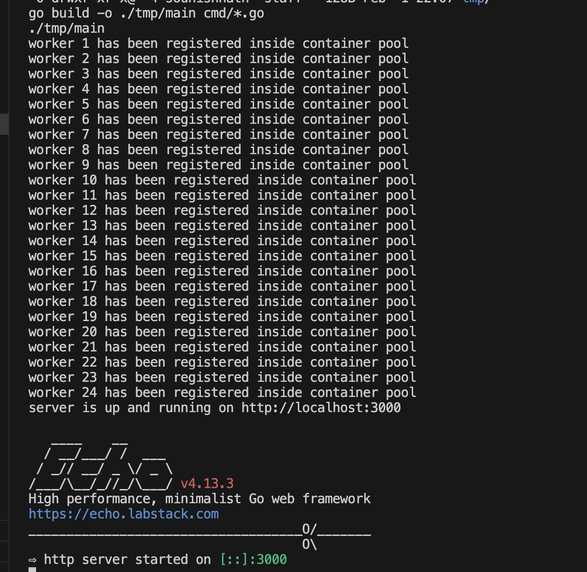

# Code Execution Sandbox Engine - CESE

Code Sandbox Runner is a **Go backend** service that enables users to submit and execute code snippets in various programming languages within isolated Sandbox Docker containers. 

This project provides a **secure and scalable environment** for running untrusted code.

Main target use cases could be -
- Ideal for educational purposes.
- Coding competitions.
- Online code execution services.
- Leetcode or Judge0 systems.

> Judge0 provides a free quota to use their API, if you are less bothered. But as a Software Engineer - building things from scratch, experiments always pulls me up.
## Appendix


**Project Structure**

```
.
├── cmd/
│   └── main.go 
├── api/
│   ├── handlers.go
│   └── utils.go
├── sandbox/
│   ├── python.go
│   ├── java.go
│   └── ... 
├── internal/
│   ├── config.go
│   ├── logger.go
│   └── ...
├── tmp/ 
├── Makefile
├── .air.toml
├── rest.http
└── README.md 
```

## Installation

To install gomodules type following - 

1. go mod tidy
2. go mod download -x
3. go mod verify
    
## Documentation


**Features**

* **Multi-language Support:** Execute code in multiple programming languages, including Python, Java, and more.
* **Docker-based Isolation:** Each code submission runs in its own dedicated Docker container, ensuring isolation and security.
* **REST API:** Submit code and retrieve execution results through a well-defined REST API.
* **Job Queueing:** Efficiently manage and execute multiple code submissions concurrently using a job queue and a pool of worker processes.
* **Detailed Error Handling:** Provides informative error messages and timestamps for debugging and troubleshooting.


**Getting Started**

0. **Discover Makefile:**
    - Ensure `build-essentials` pkg is installed.
    
    ```bash

    .PHONY: build
    build:
        ls -GFlash
        go build -o ./tmp/main cmd/*.go

    .PHONY: run
    run: build
        ./tmp/main
    ```

1. **Prerequisites:**
   - Ensure Docker is installed and running on your system.

2. **Build and Run:**
   - Use the provided `Makefile` to build and run the application:
     ```bash
     make build
     make run
     ```

**Usage**

1. **API Endpoints:** Refer to the `rest.http` file for sample HTTP requests to interact with the API. 
2. **Code Submission:** Submit code snippets to the API endpoint, specifying the desired programming language.
3. **Execution Results:** The API will return the execution output, including standard output, standard error, and any encountered errors.


**Note:**

* This is a base structure. You can further customize it based on your project's specific needs and complexity.
* Consider adding more detailed instructions on how to run tests, configure environment variables, and deploy the application.
* Include information about supported languages, API documentation, and any relevant configuration options.

**Note:** I hope this enhanced README provides a clear and informative overview of your Code Sandbox Runner project!

## API Reference

### Submit Python3 code

```
POST http://localhost:3000/api/submit HTTP/1.1
Content-Type: application/json

{
    "language": "python3",
    "base64EncodedCode": "ZGVmIHByaW1lKHgsIHkpOgogICAgcHJpbWVfbGlzdCA9IFtdCiAgICBmb3IgaSBpbiByYW5nZSh4LCB5KToKICAgICAgICBpZiBpID09IDAgb3IgaSA9PSAxOgogICAgICAgICAgICBjb250aW51ZQogICAgICAgIGVsc2U6CiAgICAgICAgICAgIGZvciBqIGluIHJhbmdlKDIsIGludChpLzIpKzEpOgogICAgICAgICAgICAgICAgaWYgaSAlIGogPT0gMDoKICAgICAgICAgICAgICAgICAgICBicmVhawogICAgICAgICAgICBlbHNlOgogICAgICAgICAgICAgICAgcHJpbWVfbGlzdC5hcHBlbmQoaSkKICAgIHJldHVybiBwcmltZV9saXN0CgoKaWYgX19uYW1lX18gPT0gIl9fbWFpbl9fIjoKICAgIHN0YXJ0aW5nX3JhbmdlID0gOTkKICAgIGVuZGluZ19yYW5nZSA9IDEwMDAKICAgIGxzdCA9IHByaW1lKHN0YXJ0aW5nX3JhbmdlLCBlbmRpbmdfcmFuZ2UpCiAgICAKICAgIGlmIGxlbihsc3QpID09IDA6CiAgICAgICAgcHJpbnQoIlRoZXJlIGFyZSBubyBwcmltZSBudW1iZXJzIGluIHRoaXMgcmFuZ2UiKQogICAgZWxzZToKICAgICAgICBwcmludCgiVGhlIHByaW1lIG51bWJlcnMgaW4gdGhpcyByYW5nZSBhcmU6ICIsIGxzdCk="
}
```

### Submit Java Code 

```

POST http://localhost:3000/api/submit HTTP/1.1
Content-Type: application/json

{
    "language": "java",
    "base64EncodedCode": "Ly8gVGhpcyBpcyBhIHNpbXBsZSBKYXZhIHByb2dyYW0uCi8vIEZpbGVOYW1lIDogIkhlbGxvV29ybGQuamF2YSIuCgpwdWJsaWMgY2xhc3MgSGVsbG9Xb3JsZCB7CiAgICAvLyBZb3VyIHByb2dyYW0gYmVnaW5zIHdpdGggYSBjYWxsIHRvIG1haW4oKS4KICAgIC8vIFByaW50cyAiSGVsbG8sIFdvcmxkIiB0byB0aGUgdGVybWluYWwgd2luZG93LgogICAgcHVibGljIHN0YXRpYyB2b2lkIG1haW4oU3RyaW5nW10gYXJncykKICAgIHsKICAgICAgICBTeXN0ZW0ub3V0LnByaW50bG4oIkhlbGxvLCBXb3JsZCIpOwogICAgfQp9"
}
```

## Screenshots - 

- ContainerPool Workers registration before server starts 
   

- Java Code Submission Output
   

- Sample Stdout
   

- Sample Stderr
   

**Note:**

Current languages supported are followings.

- Java
- Python3

**There is always room to add more language. It is now more like template to onboard new languages support.**
## Contributing

Contributions are always welcome!

Contributions are welcome! Please feel free to fork this repository and submit pull requests.


## Acknowledgements

- [This is how we built LeetCode in-house Mehul Mohan](https://www.youtube.com/watch?v=dDZV89dFmB4&t=2s)
- [Design Judge Systems - GKCS](https://www.youtube.com/watch?v=mwcadRR3nsk)
- [Sounish Nath](https://www.linkedin.com/in/sounishnath/)
## Authors

- [@linkedin/sounishnath](https://www.linkedin.com/in/sounishnath/)
- [@portfolio/sounishnath](https://sounishnath.netlify.app/)

